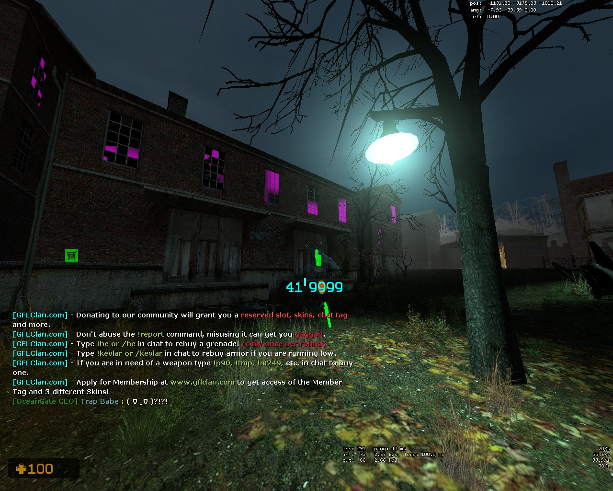
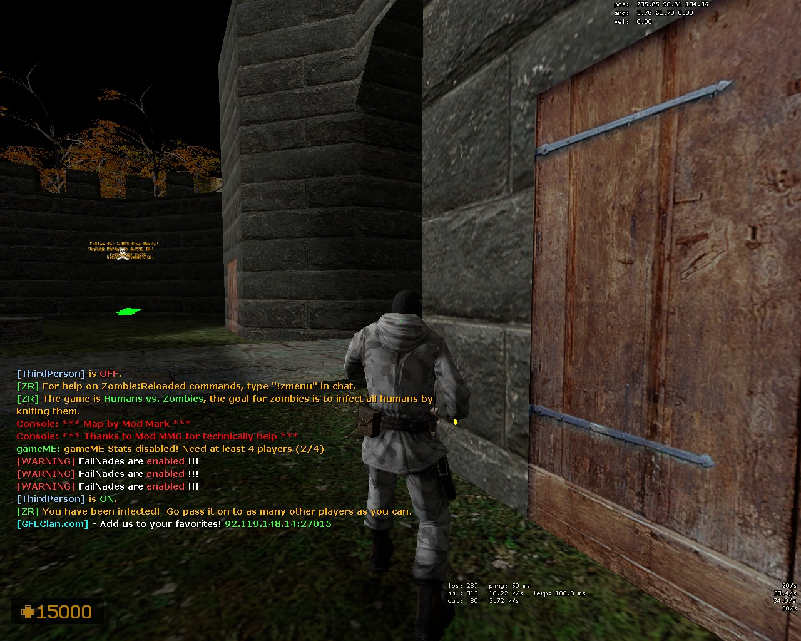

## How to Install
Take the `cstrike` folder in the 7-zip file and extract it to the directory you installed Counter-Strike: Source (for example: `C:\Program Files (x86)\Steam\steamapps\common\Counter-Strike Source`)

## What is this?
This is a replacement of all the human models in GFL ZE CS:S (as of October 15, 2023). It's a lot easier to just see plain models over the enemies (especially when I use **transparent models** and **colored viewmodel weapons**). It also turns zombies into the arctic terrorist model. This will make it a lot easier to track zombies.

This model replacement should not conflict with the other arctic T model as I generated a separate Arctic T model and material for Zombies only (which the model targets).

## Do note that this does not come with my colored weapon skins on: https://github.com/ovY9jkhTEUpllGPJRrKU/CS-S-Custom-Scripts

## Humans (Folders relative to `cstrike/download/models/player`):

```
Default
    - {current directory}, change all the ct and t models

Master Chief (Halo)
    - masterchief

Ranger (COD)
    - cod

Ujel (Rage Comics)
    - trollge

50 Cent
    - slow/50cent

Exoskeleton (Stalker)
    - csctm_stalker_exo

Gordon Freeman (Half-Life 2)
    - vad36gordon_hd

Yoshino (Date A Live)
    - yoshino

Kotori Effret (Date A Live)
    - datealive

Niko (Oneshot)
    - sasamin/oneshot

Alyx Vance (Half-Life 2)
    - vad36hl2

Vector (Resident Evil)
    - vad36raccoon_city

Nanosuit (Crysis)
    - unloze/nanosuit_fix

Zoey (Left 4 Dead)
    - techknow/left4dead

James Bond (007)
    - JB

Kurumi Tokisaki (Date A Live)
    - kurumi

Senator Armstrong (Metal Gear Rising)
    - senator_armstrong

Noob (Roblox)
    - seger/roblox_noob

Faith Connors (Mirrors Edge)
    - hhp227/mirrors_edge

Serah Farron (Final Fantasy)
    - hhp227/tenten_loveff

Cloud (Final Fantasy)
    - dakotec

2B (NiER: Automata)
    - gkuo88/lev

A2 (NiER: Automata)
    - gkuo88/lev

Marie Rose (Dear or Alive)
    - gkuo88/marierose (also replaced emilia since some people use it)

Kiana (Honkai Impact 3)
    - dakotec/kiana

Pickle Rick (Rock and Morty)
    - picklerick

Peter Griffin (Family Guy)
    - family_guy/peter_griffin

Rorschach
    - slow/rorschach

Gene:
    - gkuo88/pfy/gene

Gandalf
    - slow/amberlyn/lotr/gandalf
```

## Zombies (Folders relative to `cstrike/download/models/player`):

```
Default Zombie
    - zh (all 3 models)
    - techknow/zp

Hell Knight (Doom)
    - ics/hellknight_red

Arctic Predator (AvP)
    - vad36predator

Hunter (Left 4 Dead)
    - techknow/left4dead

Draugr (TESV Skyrim)
    - raijin

General Grievous (Star Wars)
    - b4p/b4p_grievous

Witch King (Lord of the Rings)
    - slow/amberlyn/lotr/witch_king

Alma (F.E.A.R)
    - ../mapeadores/kaem/alma

Jack Sparrow (Pirates of the Caribbean)
    - vad36jack_sparrow

Husk (Barotrauma)
    - barotrauma

Witch
    - techknow/left4dead
```